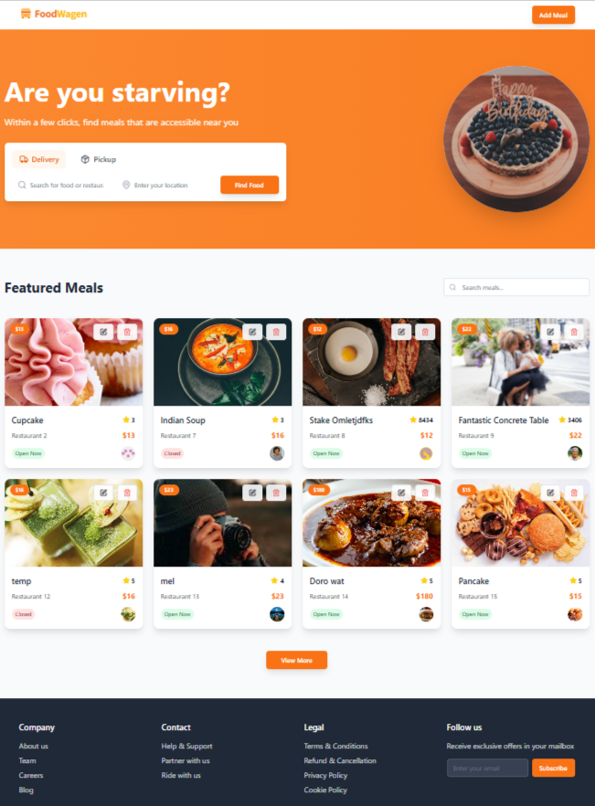

# 🍽️ FoodWagen - Food Recipe Website

A modern, responsive food recipe website built with React, TypeScript, and Tailwind CSS. Discover delicious meals, manage your favorite recipes, and explore a wide variety of cuisines all in one place.



## ✨ Features

- **Browse Meals**: Explore a curated selection of featured meals
- **Search Functionality**: Find specific meals or restaurants with real-time search
- **Meal Management**: Add, edit, and delete meals with a user-friendly interface
- **Responsive Design**: Optimized for mobile, tablet, and desktop devices
- **Modern UI**: Clean design with smooth animations and hover effects
- **API Integration**: Real-time data fetching with MockAPI
- **Loading States**: Smooth loading indicators for better user experience

## 🚀 Performance Optimizations

- **Lazy Loading**: Components and images load as needed
- **Memoization**: React Query for efficient API call caching
- **Tree Shaking**: Only necessary code is bundled
- **Optimized Bundle**: Vite build system for fast compilation
- **Responsive Images**: Optimized image loading across devices

## 🛠️ Tech Stack

- **Frontend**: React 18, TypeScript
- **Styling**: Tailwind CSS, Shadcn/UI Components
- **State Management**: TanStack React Query
- **Build Tool**: Vite
- **Icons**: Lucide React
- **Forms**: React Hook Form with Zod validation
- **API**: MockAPI for backend simulation

## 📱 Fully Responsive Design

The website works flawlessly across all device types:

- **Mobile (320px+)**: Touch-optimized interface with collapsible navigation
- **Tablet (768px+)**: Adaptive grid layouts and optimized spacing
- **Desktop (1024px+)**: Full-featured layout with hover interactions
- **Large Screens (1440px+)**: Enhanced spacing and larger content areas

## 🔧 Installation & Setup

### Prerequisites

Make sure you have the following installed:
- Node.js (version 16 or higher)
- npm or yarn package manager
- Git

### Step 1: Clone the Repository

```bash
git clone https://github.com/your-username/foodwagen.git
cd foodwagen
```

### Step 2: Install Dependencies

Using npm:
```bash
npm install
```

Using yarn:
```bash
yarn install
```

### Step 3: Start Development Server

Using npm:
```bash
npm run dev
```

Using yarn:
```bash
yarn dev
```

The application will be available at `http://localhost:5173`

### Step 4: Build for Production

Using npm:
```bash
npm run build
```

Using yarn:
```bash
yarn build
```

## 🌐 API Endpoints

The application uses MockAPI for data management:

- **Base URL**: `https://6852821e0594059b23cdd834.mockapi.io/Food`
- **Get All Meals**: `GET /Food`
- **Create Meal**: `POST /Food`
- **Update Meal**: `PUT /Food/[id]`
- **Delete Meal**: `DELETE /Food/[id]`
- **Search Meals**: `GET /Food?name=[searchParam]`

## 📁 Project Structure

```
src/
├── components/          # Reusable UI components
│   ├── ui/             # Shadcn/UI components
│   ├── Header.tsx      # Navigation header
│   ├── Hero.tsx        # Landing section
│   ├── MealCard.tsx    # Meal display card
│   └── ...
├── hooks/              # Custom React hooks
│   └── useMeals.ts     # API data fetching hooks
├── pages/              # Page components
│   └── Index.tsx       # Main page
├── services/           # API services
│   └── api.ts          # API service functions
├── types/              # TypeScript type definitions
│   └── index.ts        # Main type definitions
└── lib/                # Utility functions
```

## 🎨 Design Features

- **Modern Color Palette**: Orange gradient theme with clean whites and grays
- **Smooth Animations**: Hover effects and transitions throughout
- **Card-Based Layout**: Clean meal cards with shadows and rounded corners
- **Typography**: Clear hierarchy with custom fonts
- **Icons**: Lucide React icons for consistent visual language

## 🚀 Deployment

The project can be deployed to various platforms:

- **Vercel**: Connect your GitHub repository for automatic deployments
- **Netlify**: Drag and drop the build folder or connect via Git
- **GitHub Pages**: Use the built-in GitHub Actions workflow

## 📱 Mobile Responsiveness Implementation

The responsive design is achieved through:

1. **Tailwind CSS Breakpoints**:
   - `sm:` (640px+) - Small tablets
   - `md:` (768px+) - Tablets
   - `lg:` (1024px+) - Small desktops
   - `xl:` (1280px+) - Large desktops

2. **Flexible Grid System**:
   ```css
   grid-cols-1 sm:grid-cols-2 lg:grid-cols-3 xl:grid-cols-4
   ```

3. **Responsive Typography**:
   ```css
   text-3xl md:text-4xl lg:text-5xl
   ```

4. **Mobile-First Approach**: Base styles for mobile, then enhanced for larger screens

## 🤝 Contributing

1. Fork the repository
2. Create a feature branch (`git checkout -b feature/amazing-feature`)
3. Commit your changes (`git commit -m 'Add amazing feature'`)
4. Push to the branch (`git push origin feature/amazing-feature`)
5. Open a Pull Request

## 📄 License

This project is licensed under the MIT License - see the [LICENSE](LICENSE) file for details.

## 🙏 Acknowledgments

- [Unsplash](https://unsplash.com) for beautiful food photography
- [Shadcn/UI](https://ui.shadcn.com/) for the component library
- [Lucide](https://lucide.dev/) for the icon set
- [MockAPI](https://mockapi.io/) for the backend simulation

---

Built with ❤️ by [Your Name]
